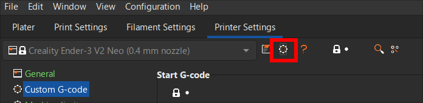

import YoutubeVideo from "../../../components/YoutubeVideo";

A 3D slicer is a crucial software tool in the 3D printing process. It serves as
a bridge between the digital 3D model and the physical 3D printer. Its primary
function is to convert a 3D model into a set of instructions, known as G-code,
that the printer can understand and execute to create the desired object.

The 3D slicer performs several essential tasks:

- Slicing: It divides the 3D model into thin horizontal layers, determining the
  precise path the printer nozzle should follow to deposit the material for each
  layer.

- Infill Generation: It calculates the internal structure of the object, called
  infill, which determines the overall density and strength of the printed
  object.

- Support Structure Generation: For objects with overhangs or complex
  geometries, the slicer creates temporary support structures that prevent the
  object from collapsing during printing.

- Parameter Adjustment: The slicer allows users to fine-tune various printing
  parameters, such as layer height, temperature, speed, and cooling settings, to
  optimize the printing process for the desired material and object properties.

- G-code Generation: The slicer generates the final G-code file, which contains
  the complete set of instructions for the printer to follow, including the
  precise movements of the printer nozzle, extruder temperature, and fan speed.

## Setting Up PrusaSlicer

1. Download the latest stable PrusaSlicer from
   [Github](https://github.com/prusa3d/PrusaSlicer/releases/latest)
2. Install the slicer.
3. Open PrusaSlicer.
4. If it greets you with a popup about SSL Certificates, Check
   `Remember my choice` and click `Yes`.
5. You will then be greeted with the `PrusaSlicer Configuration Wizard`, then
   click `Next`.
6. Some Prusa Printers will be checked by default, uncheck them or click `None`
   in the upper right hand corner, then keep clicking `Next` until reach the
   `Other Vendors` page.
7. On the `Other Vendors` page, Check `Creality`, then Click `Next`
8. Check `0.4 mm nozzle` under `Creality Ender-3 V2 Neo`, uncheck everything
   else.
9. Keep Clicking `Next` until you reach the `View Mode` page.
10. On `View Mode` page, select `Expert Mode` and click `Finish`.

At this point the basic setup for stock Ender 3 V2 Neo is done but since we have
[Professional Firmware](https://github.com/mriscoc/Ender3V2S1) installed in our
printer, we will have to make some changes (refer
[this](https://github.com/mriscoc/Ender3V2S1/wiki/Slicer-G-code-Scripts) for
more details)

## Modifications for Professional Firmware

1. Goto `Printer Settings` -> `Custom G-code`.
2. Paste the following into `Start G-code`

   ```
   ;
   ; First layer print x min = [first_layer_print_min_0]
   ; First layer print y min = [first_layer_print_min_1]
   ; First layer print x max = [first_layer_print_max_0]
   ; First layer print y max = [first_layer_print_max_1]
   ; Total layer count = [total_layer_count]
   ;
   M201 X500.00 Y500.00 Z100.00 E5000.00 ;Setup machine max acceleration
   M203 X500.00 Y500.00 Z20.00 E50.00 ;Setup machine max feedrate
   M204 P500.00 R1000.00 T500.00 ;Setup Print/Retract/Travel acceleration
   M205 X8.00 Y8.00 Z0.40 E5.00 ;Setup Jerk
   M220 S100 ;Reset Feedrate
   M221 S100 ;Reset Flowrate

   G90 ; use absolute coordinates
   M83 ; extruder relative mode
   M104 S[first_layer_temperature] ; set extruder temp
   M140 S[first_layer_bed_temperature] ; set bed temp
   M190 S[first_layer_bed_temperature] ; wait for bed temp
   M109 S[first_layer_temperature] ; wait for extruder temp
   G29 P1 ; Home automatically and run mesh leveling on every print
   G29 A ; Activate UBL
   C108 ; Close the mesh viewer (optional)
   G1 Z2 F240
   G1 X2 Y10 F3000
   G1 Z0.28 F240
   G92 E0
   G1 Y190 E15 F1500 ; intro line
   G1 X2.3 F5000
   G92 E0
   G1 Y10 E15 F1200 ; intro line
   G92 E0
   ```

3. Paste the following into `End G-code`

   ```
   {if max_layer_z < max_print_height}G1 Z{z_offset+min(max_layer_z+2, max_print_height)} F600{endif} ; Move print head up
   G1 X5 Y170 F{travel_speed*60} ; present print
   {if max_layer_z < max_print_height-10}G1 Z{z_offset+min(max_layer_z+70, max_print_height-10)} F600{endif} ; Move print head further up

   M140 S0 ; turn off heatbed
   M104 S0 ; turn off temperature
   M107 ; turn off fan
   M84 ; disable motors

   ```

## Octoprint Setup (Optional)

You can direct start prints from PrusaSlicer if you have Octoprint and if you
are connected to same same network as your printer.

1. Note your printer's IP Address.
2. Open Octoprint interface in your browser.
3. Goto `Settings` (click the spanner icon in the top right corner).
4. Click `API` in the left sidebar.
5. Copy the `Global API Key` displayed there.
6. Open PrusaSlicer.
7. Goto `Printer Settings` and click on the settings icon as shown below.
   
8. In the popup, Write a name for the printer, such as `Ender3V2Neo`
9. Set `Host Type` to `OctoPrint`
10. Enter the printer's IP Address in `Hostname, IP or URL`.
11. Paste the `API Key` you copied in step 4 in `API Key / Password` field.
12. Click `Test` to check if the details are correct.
13. If it connects successfully, close the popup and click `OK`

PrusaSlicer is now setup to start slicing.

## Slicing models

Watch this video to understand the PrusaSlicer interface and start slicing.

:::note[Note]

Watch the video from 7:33 as the video starts with setup but we have already
covered that [here](#setting-up-prusaslicer).

:::

<YoutubeVideo videoId="OzCo9x4QwPY" start={453} />
