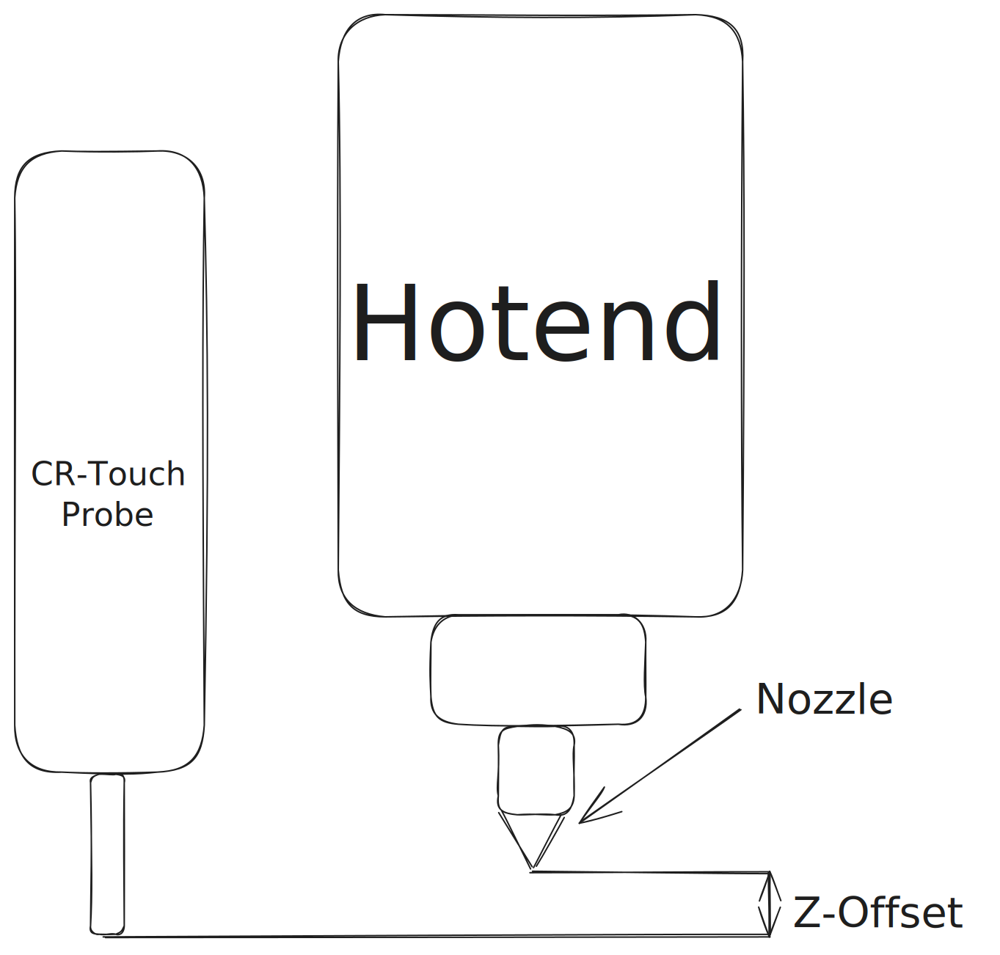

import YoutubeVideo from "../../../components/YoutubeVideo";

## 1. Hardware Assembly

The printer arrives in a nicely packaged cardboard box partly pre-assembled and
requires some assembly to be performed.

Follow the official assembly video by creality below till 6:28

:::note[Note]

I have installed a better
[Professional Firmware](https://github.com/mriscoc/Ender3V2S1) so the
instructions after 6:28 in the assembly video don't apply anymore

:::

    <YoutubeVideo videoId="dErZygToGsw" end="388" />

## 2. Professional Firmware Quick Setup

For a more comprehensive setup guide see:

Now we need to do some software setup. The printer has a click-wheel below the
LCD Screen to control the UI. Turning the knob clockwise will move the UI
Forward and turning it counter-clockwise will move the UI Backwards. The wheel
can pre pressed to register clicks in the UI.

:::note[Note]

{/* TODO:add link to heading here */}

I am assuming that the printer physical setting have already been done (as
decribed in
[Professional Firmware Setup](/reference/professional-firmware-setup)) out of
the box for the following steps to work.

:::

### 3. Home the printer

Homing the printer will ensure that the printer knows the coreect position of
the print head. For X and Y axes, the printer uses a limit switch. For the Z
axis, it uses a CR-Touch Probe/Sensor. Follow this video to home the printer.

<YoutubeVideo videoId="tt7gfkP0jtA" />

### 4. Tram the bed

Next, we need to tram the bed. Before tramming remember to clean the bed with a
microfiber cloth. Bed Tramming makes sure that the print bed is parallel to the
printer's X and Y axes. Follow the video below to tram your bed.

<YoutubeVideo videoId="SVyjJ6fC8J4" />

:::note[Bed Tramming]

The tramming wizard tells how far the bed's corners are from the Z axis zero
point. Ideally the distance should be 0 but practically we adjust the screws
until we achieve upto 0.04mm variation between max and the min Z distance.

:::

### 5. Build a Bed Mesh

Next we need to build a bed mesh. Even though our corners are trammed, the print
bed is rarely completely flat. So the CR Touch Sensor can probe the bed at 36
different points and build a mesh of the inconsistencies in the print bed's
surface.

Goto `Prepare` > `Auto build Mesh` to start mesh leveling process. This will
heat up the bed to 50&deg;C an then probe 36 points on the bed. You can see the
results on the screen. Press `Continue` to save the mesh. This mesh will be
loaded automatically every time the printer boots.

:::note[The prints won't stick to the bed if it is not clean]

Make sure that the bed is clean before printing/building a bed mesh. Always use
a Microfiber Cloth (The ones that are used to clean eyeglasses) to clean the
bed, using a regular cloth will leave cloth fibres on the bed and will result in
prints not sticking to the bed.

:::

<YoutubeVideo videoId="DWLOGQ__CJo" />

:::note[The corners are leveled but other points are not]

The corners in the Bed Mesh will be leveled as we already manually levelled them
in the previous step but the other points are not leveled which is okay. The
purpose of building this mesh is so that the while printing the incinsistencies
can be compensated by adjusting the Z height.

:::

### 6. Set the Z-Offset

This is the most important step while setting up the printer. The printer
determines the Z=zero position using the CR-Touch Probe but the actual nozzle
height is different from the Probe's height. See the image below to understand
the difference.

- Goto `Prepare` -> `Z Probe Wizard` -> `Auto Home`
- Then click `Move Z to Home`
- The nozzle will now move to Home Position `(0,0)`
- Put a A4 Sheet Paper below the nozzle and adjust the `Probe Z Offset` using
  the Click Wheel until the nozzle just touches the paper.
- Turning the wheel clockwise will move the nozzle up and turning it
  anti-clockwise will lower it.
- You should be able to move to paper between the nozzle and the bed but with
  some resistance.
- Ensure that the Z Offset is low enough to experience some resistance but high
  enough to allow the paper to be inserted between the bed and the nozzle from
  outside.

:::note[This can feel a bit daunting]

The Z offset value will be negative, I ususally find it to be somewhere between
`-2.1` to `-2.32`

Setting the Z offset is a skill you will gain with some experience. Just make
sure that you don't set it too low or you will scratch the print bed.

:::

## 7. Load Filament

We need to load the filament to start printing!

- Goto `Prepare` > `Filament Management` > `Load Filament`
- The hotend will heat to 180&deg;C
- It will then give 2 options `Load` and `Continue`
- Now cut the filament at an angle, hold the extruder spring and push it into
  the extruder (See the video below) until you feel resistance (You will feel it
  after you push around 30cm of filament)
- Once you feel some resistance, click `Purge`, this will push the filament into
  hotend and you will see it coming out of the nozzle.
- Clean the oozed out filament using a pair of tweezers.
- The video below demostrates the process.

<YoutubeVideo videoId="-haL_RVxI5A" />

## 8. Print your first model!

Time to print our first model, Finally!

- Clean the bed
- Goto `Media` and you will see a file named `IETE`, if you don't, download it
  from [here](../../../../public/IETE.gcode) and copy it to the SD Card (A card
  reader is included in the box).
- Click on the IETE file and then click `Print`
- Watch the print start, Printer will first heat up, then create a bed mesh
  again and then start printing.

Next, you might wish to print your own models and you will need a slicer
software for that. Head over to the next section which will help you get started
with the slicer.
